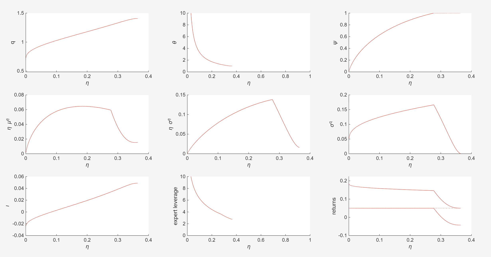
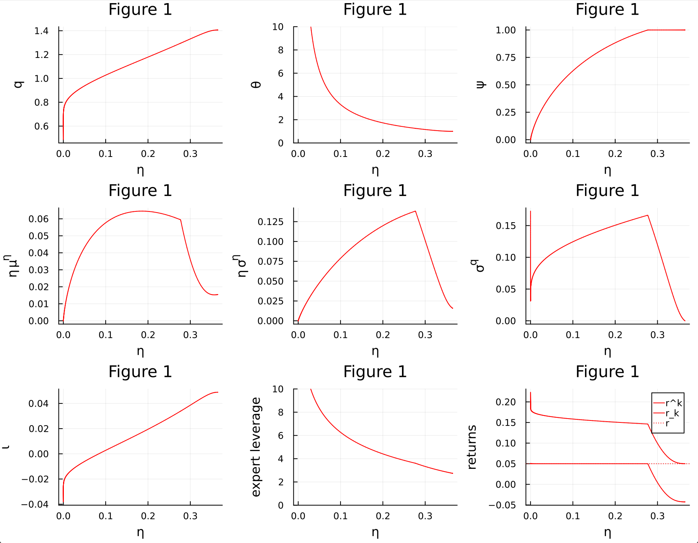
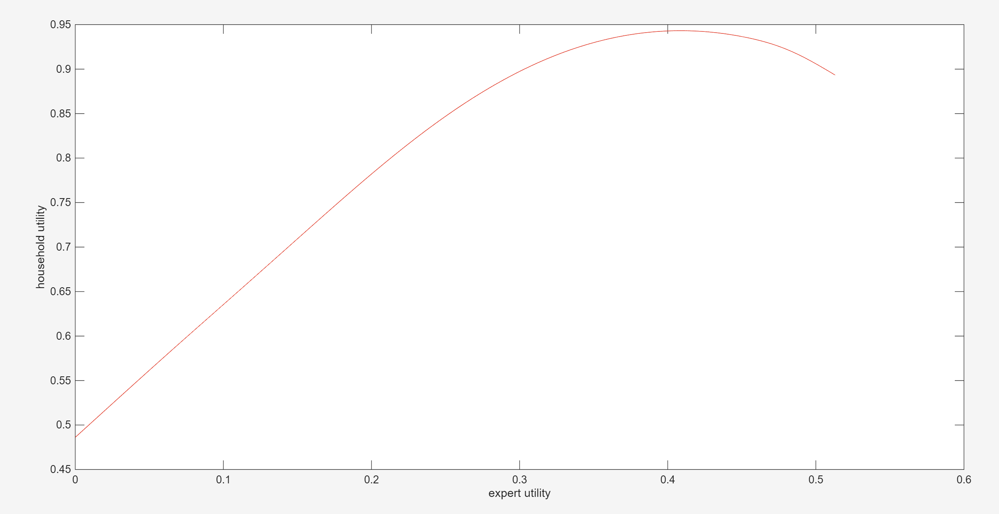
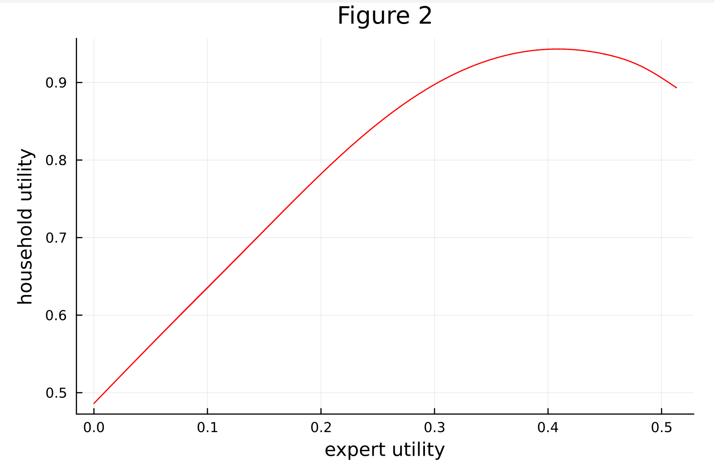

::: {.callout-note}

# Collegio Carlo Alberto Replication Project

This report was created as part of the assessment for the [`Computational Economics` Course](https://floswald.github.io/CompEcon/) in the PhD program at Collegio Carlo Alberto taught by [Florian Oswald](https://floswald.github.io/).

:::

## Paper and Replication Package

This report attempts a replication of 

* paper: 10.1257/aer.104.2.379
* replication package: 10.3886/E112732V1

by using the `julia` computation language.

We have been able to replicate the following exhibits:

1. figure one: it depicts the financial and macroeconomic variables with respect to eta (q, theta, psi, the drift of the wealth, the volatility of the wealth, the endogenous volatility of the price, iota, the expert’s leverage, the returns)
2. figure two: it shows the relationship between experts' wealth and households' wealth, by representing the total utility of the experts on the x-axis and the total utility of the families on the y-axis.

## High Level Description of Computational Problem in Paper

The model's base parameters are defined in the principal function `run_all`, setting the productivity ($a = 0.11$, $\underline{a} = 0.05$), depreciation rate ($\delta = 0.03$, $\underline{\delta} = 0.06$), and patience rates ($\rho = 0.06$, $r = 0.05$) for experts and households, respectively, where $r$ also serves as the riskless lending rate.

The core mathematical problem is a system of Ordinary Differential Equations (ODEs) defined in `fnct!`. The state vector tracks the marginal utility of experts ($\theta$) and the price of capital ($q$), along with their first derivatives with respect to the experts' wealth share ($\eta$):
$$u = [\theta, \theta', q, q']^T$$
Using Ito's Lemma, the system computes the second derivatives to update the derivative vector:
$$\frac{du}{d\eta} = [\theta', \theta'', q', q'']^T$$

The computational workflow consists of three main tasks. First, an initial bisection method computes the boundary conditions for the price of capital: $q_{max}$ (when $\eta \to 1$) and $\underline{q}$ (when $\eta \to 0$), establishing the initial condition $q(0) = \underline{q}$. Second, during the ODE evaluation, an `investment(q)` function calculates the actual rate of new capital creation ($\Phi$) and the optimal investment rate ($\iota$). Within this step, an inner bisection method determines $\psi$, the fraction of physical capital managed by experts, and evaluates the shock amplification resulting from the experts' financial leverage. 

Finally, because the initial derivative $q'(0)$ is unknown, a Shooting Method is employed to solve the Boundary Value Problem. The system is integrated from $\eta = 0$ to $\eta = 1$ using the `Tsit5` Runge-Kutta solver. A callback vector evaluates three stop conditions: $q > q_{max}$, $\theta' = 0$, or $q' = 0$. If $q'$ reaches 0 prematurely, the trajectory was too low and the initial guess for $q'(0)$ is adjusted upward; otherwise, it is adjusted downward. This shooting procedure iterates 50 times to converge on the correct $q'(0)$ before performing the final integration to generate the plotted solution.

## Computational Requirements

Here are the original package's computational requirements:

- [ ] No requirements specified
- [x] Software Requirements specified as follows:

  - MATLAB, R2014b

- [x] Computational Requirements specified as follows:
  - Standard personal laptop or desktop. No high-performance cluster or GPU acceleration is required.
- [x] Time Requirements specified as follows:
  - Execution time is on the order of seconds to complete the 50 iterations of the shooting method and the final integration on a standard machine.

## Our Computational setup

- Personal Laptop Lenovo Yoga Slim 7, Intel Core i7, 32 GB of RAM, running Windows 11 with WSL2 

### Software Requirements

- Julia, version 1.10 
- `DifferentialEquations.jl` (for the ODE solver and callbacks)
- `Plots.jl` (for plotting)
- `ADTypes.jl`
- Visual Studio Code, version 1.121 
- Quarto 

# Replication

- Figure 1: Perfect alignment with the MATLAB generated plots
- Figure 2: Perfect alignment with the MATLAB generated plots

## Images
 
::: {#fig-three layout-ncol=2}

:::

